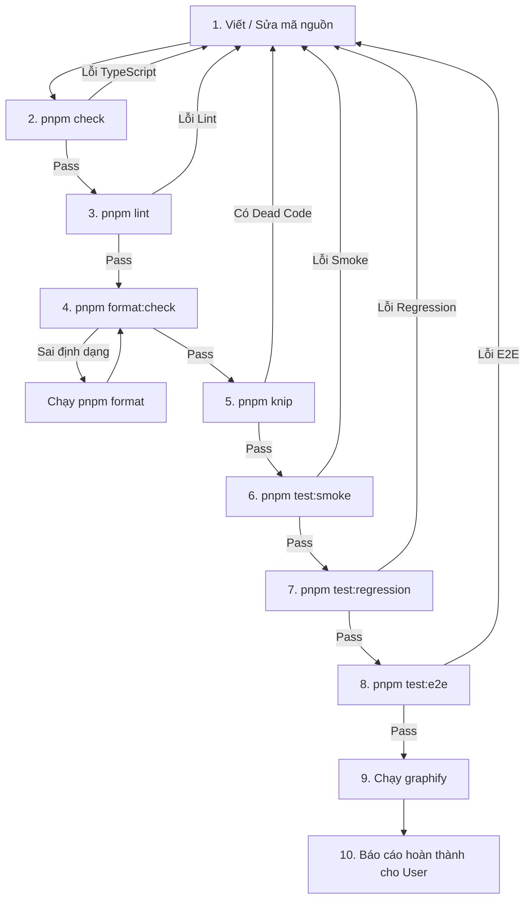

# 📋 QUY TRÌNH PHÁT TRIỂN & HỆ THỐNG KIỂM THỬ (DEVELOPMENT & TESTING WORKFLOW)

> **Tài liệu quy chuẩn bắt buộc** dành cho tất cả nhà phát triển (Developers) và AI Coding Agents khi tham gia chỉnh sửa, thêm tính năng hoặc tái cấu trúc mã nguồn dự án **Ebook Tools**.

---

## 🔒 1. Quy tắc Quản lý Gói (Package Manager Rule)

- **CHỈ ĐƯỢC DÙNG `pnpm`** (Tuyệt đối không dùng `npm` hoặc `yarn`).
- Luôn tuân thủ lockfile `pnpm-lock.yaml`.

```bash
# Cài đặt package mới
pnpm add <package-name>

# Cài đặt dev dependency
pnpm add -D <package-name>
```

---

## 🧱 2. Kiến trúc Hệ Thống Kiểm Thử 4 Tầng (4-Tier Testing Strategy)

Để đảm bảo vừa có tốc độ phát triển cực nhanh, vừa có một **tấm lưới an toàn (Safety Net)** vững chắc chống regression khi refactor, hệ thống test được phân thành 4 tầng rõ ràng:

```
                          ALL TEST SUITES
                                │
        ┌───────────────────────┼───────────────────────┬───────────────────────┐
        │                       │                       │                       │
     TẦNG 1                  TẦNG 2                  TẦNG 3                  TẦNG 4
   SMOKE TESTS          UNIT / INTEGRATION         REGRESSION             BROWSER E2E
   (test:smoke)            (test / unit)        (test:regression)         (test:e2e)
        │                       │                       │                       │
     ~350ms                   ~1s                     ~400ms                   ~15s
        │                       │                       │                       │
  Mỗi lần lưu code        Khi sửa module        Trước khi commit          Trước khi PR/Release
```

---

### 🔹 Tầng 1: Smoke Tests (`pnpm test:smoke`)

- **Tốc độ**: Siêu nhanh (~300-400ms).
- **Mục tiêu**: Chạy liên tục mỗi khi lưu/thay đổi code để đảm bảo các luồng chức năng xương sống không bị gãy:
  1. TXT → EPUB Packing
  2. Markdown → EPUB Packing
  3. EPUB → TXT Extraction
  4. EPUB Editor & Live Preview Builder
  5. EPUB Cleaner & Optimizer
  6. EPUB Multi-profile Validator

### 🔹 Tầng 2: Unit & Integration Tests (`pnpm test:unit` hoặc `pnpm test`)

- **Tốc độ**: ~1 giây (240+ bài test).
- **Mục tiêu**: Kiểm tra chi tiết từng hàm logic, thuật toán heuristic nhận diện chương, regex OCR, mã hóa UTF-8 tiếng Việt, phân tách PDF, bóc tách ảnh nền ML.

### 🔹 Tầng 3: Regression Safety Net (`pnpm test:regression`)

- **Tốc độ**: ~400ms.
- **Mục tiêu**: **Tấm lưới an toàn vĩnh viễn** chống lỗi phát sinh sau khi refactor:
  - **Round-Trip Preservation**: `TXT → EPUB → EPUB to TXT` bảo toàn tuyệt đối 100% tiêu đề chương, đoạn văn tiếng Việt, định dạng in đậm/nghiêng.
  - **TOC Integrity**: Mục lục phân cấp, loại trừ ghi chú riêng tư (`@!t`, `.no-toc`), đồng bộ giữa `nav.xhtml` và `toc.ncx`.
  - **Cleaner Safety**: Không bao giờ xóa nhầm tài nguyên đang được CSS `url()` hoặc thẻ `` tham chiếu.
  - **Validator Resilience**: Chẩn đoán chính xác các lỗi file hỏng, container.xml dị dạng, thiếu tệp manifest.
  - **Kịch bản thực tế phức tạp**: Chạy toàn bộ các luồng sản xuất thực tế tại `tests/real-world-workflows.test.ts`.

### 🔹 Tầng 4: Full Browser E2E & Output File Inspection (`pnpm test:e2e`)

- **Tốc độ**: ~15-20s (Playwright Chromium).
- **Nguyên tắc cốt lõi (Không chỉ click UI)**:
  ```
  Browser → Upload File → Trigger Convert/Export → Download Output File → Giải nén File tải về → Validate ZIP → Parse OPF & Spine → Kiểm tra Mục lục TOC → Kiểm tra chính xác từng dòng chữ tiếng Việt
  ```
- **Kịch bản kiểm thử**:
  - `Full Flow 1`: Upload `.txt` tiếng Việt → Đóng gói → Tải `.epub` → Giải nén kiểm tra cấu trúc ZIP, file `content.opf`, `nav.xhtml`, nội dung các file `chap_*.xhtml`.
  - `Full Flow 2`: Upload `.epub` → Bắt đầu chuyển đổi → Tải `.txt` → Đọc nội dung text kiểm tra từng hồi, từng đoạn văn.
  - `Full Flow 3`: Upload `.epub` → Mở EPUB Editor → Sửa Metadata Title → Xuất file EPUB → Kiểm tra file tải về đã lưu đúng tiêu đề mới trong `content.opf`.
  - Kiểm thử toàn bộ giao diện: Ornaments, Trang lót (Jacket), Validator Modal, Cleaner Modal, Markdown Fixer, PDF Splitter.

### 🔹 Tầng Mở rộng: Stress & Heavy Load (`pnpm test:stress`)

- **Lệnh**: `pnpm test:stress`
- **Mục tiêu**: Kiểm thử sức chịu tải với đại tác phẩm **1.000 đến 5.000 chương**, đo lường tốc độ phân tích và tiêu thụ RAM.

---

## 🎯 3. Ma Trận Hướng Dẫn: "Sửa Gì - Chạy Test Gì?" (Test Decision Matrix)

Mỗi khi bạn sửa một thành phần mã nguồn, hãy tra cứu bảng sau để biết chính xác các bài test cần chạy:

| Bạn vừa sửa module nào?                 | Các file liên quan                                                                  | Lệnh Test bắt buộc phải chạy                                                                                           |
| :-------------------------------------- | :---------------------------------------------------------------------------------- | :--------------------------------------------------------------------------------------------------------------------- |
| **Mọi thay đổi nhỏ / Lưu code**         | Bất kỳ file nào trong `src/`                                                        | `pnpm test:smoke`                                                                                                      |
| **TXT Parser & EPUB Packer**            | `src/lib/epub-packer/**`                                                            | `pnpm test:smoke`<br/>`vitest tests/epub-packer.test.ts tests/real-world-workflows.test.ts`<br/>`pnpm test:regression` |
| **Markdown Fixer & ZIP Grouper**        | `src/lib/markdown-fixer/**`<br/>`src/lib/epub-packer/parser/epub-markdown-utils.ts` | `vitest tests/markdown-fixer.test.ts tests/real-world-workflows.test.ts`<br/>`pnpm test:regression`                    |
| **EPUB to TXT Converter**               | `src/lib/epub-to-txt/**`                                                            | `vitest tests/epub-to-txt.test.ts`<br/>`pnpm test:smoke`<br/>`pnpm test:regression`                                    |
| **EPUB Editor & TOC Operations**        | `src/lib/epub-editor/epub-editor.ts`<br/>`src/lib/epub-editor/epub-book-ops.ts`     | `vitest tests/epub-editor.test.ts tests/epub-book-ops.test.ts`<br/>`pnpm test:regression`<br/>`pnpm test:e2e`          |
| **EPUB Cleaner & Optimizer**            | `src/lib/epub-editor/epub-cleaner.ts`                                               | `vitest tests/epub-cleaner.test.ts`<br/>`pnpm test:regression`                                                         |
| **EPUB Validator (Generic/Kobo/EPUB3)** | `src/lib/epub-editor/epub-validator.ts`                                             | `vitest tests/epub-validator.test.ts`<br/>`pnpm test:regression`                                                       |
| **PDF Splitter & OCR Helpers**          | `src/lib/pdf-splitter/**`<br/>`src/lib/epub-packer/parser/epub-ocr-utils.ts`        | `vitest tests/pdf-splitter.test.ts tests/real-world-workflows.test.ts`                                                 |
| **Image Background Removal (ML)**       | `src/lib/image-bg-remove/**`                                                        | `vitest tests/image-bg-remove.test.ts`                                                                                 |
| **Core Types / Refactor diện rộng**     | `src/lib/types/**`<br/>`src/lib/utils/**`                                           | `pnpm test`<br/>`pnpm test:regression`<br/>`pnpm test:e2e`                                                             |
| **Giao diện trang (UI Routes)**         | `src/routes/**`                                                                     | `pnpm test:e2e`                                                                                                        |

---

## 🔄 4. Chu trình Chỉnh Sửa Code Chuẩn (Standard Quality Gate Flow)

Mỗi khi thực hiện bất kỳ thay đổi nào trong mã nguồn, bạn **PHẢI** thực hiện tuần tự theo quy trình sau:



---

### Chi tiết các bước Quality Gates:

1. **Bước 1: Viết / Sửa code**: Tuân thủ Svelte 5 Rune (`$state`, `$derived`, `$props`) và kiến trúc mô-đun hóa.
2. **Bước 2: Kiểm tra kiểu (`pnpm check`)**: Đảm bảo **0 errors, 0 warnings**.
3. **Bước 3: Kiểm tra linter (`pnpm lint`)**: Đảm bảo tuân thủ tiêu chuẩn ESLint.
4. **Bước 4: Chuẩn hóa format (`pnpm format:check`)**: Đảm bảo tuân thủ [.prettierrc](file:///.prettierrc). Nếu sai, chạy `pnpm format`.
5. **Bước 5: Quét mã rác (`pnpm knip`)**: Không để lọt exports thừa hoặc dependencies không dùng.
6. **Bước 6: Chạy Smoke Tests (`pnpm test:smoke`)**: Xác nhận ngay các luồng chính hoạt động ổn định.
7. **Bước 7: Chạy Regression Suite (`pnpm test:regression`)**: Đảm bảo không làm hỏng bất kỳ tính năng nào trước đó.
8. **Bước 8: Chạy Browser E2E (`pnpm test:e2e`)**: Xác thực thao tác người dùng và kiểm tra tính toàn vẹn của tệp tải về.
9. **Bước 9: Cập nhật Graphify (`graphify . --code-only && graphify cluster-only .`)**: Đồng bộ đồ thị tri thức kiến trúc dự án.
10. **Bước 10: Báo cáo kết quả cho Người Dùng**: Tóm tắt file sửa và báo cáo trạng thái PASS của toàn bộ Quality Gates.

---

## ⚡ 5. Bảng Tra Cứu Lệnh Nhanh (Cheat Sheet)

| Lệnh                   | Ý nghĩa                                           | Thời gian  | Khi nào dùng                |
| :--------------------- | :------------------------------------------------ | :--------- | :-------------------------- |
| `pnpm dev`             | Khởi chạy máy chủ phát triển (localhost:5173)     | —          | Khi lập trình giao diện     |
| `pnpm check`           | Kiểm tra lỗi TypeScript & Svelte Rune             | ~2s        | Sau khi sửa code            |
| `pnpm lint`            | Kiểm tra lỗi ESLint                               | ~1s        | Trước khi commit            |
| `pnpm format`          | Tự động format toàn bộ codebase bằng Prettier     | ~1s        | Trước khi commit            |
| `pnpm format:check`    | Kiểm tra tính tuân thủ định dạng Prettier         | ~1s        | Trong CI / Quality Gate     |
| `pnpm knip`            | Quét file/export rác                              | ~2s        | Trước khi commit            |
| `pnpm test:smoke`      | Chạy bộ kiểm thử nhanh các luồng xương sống       | **~350ms** | **Mỗi khi lưu code**        |
| `pnpm test:unit`       | Chạy toàn bộ các bài unit test đơn lẻ             | ~1s        | Khi phát triển module       |
| `pnpm test:regression` | Chạy kiểm thử an toàn chống regression            | **~400ms** | **Trước khi commit**        |
| `pnpm test:e2e`        | Chạy trình duyệt Playwright E2E & soi file output | ~15s       | **Trước khi release/PR**    |
| `pnpm test:stress`     | Chạy kiểm thử tải nặng (1.000+ chương)            | ~500ms     | Định kỳ kiểm tra tải        |
| `pnpm test`            | Chạy toàn bộ 240+ unit/integration test suites    | ~1s        | Thường xuyên trong khi code |
| `pnpm test:watch`      | Chế độ tự động test lại khi lưu file              | —          | Khi viết tính năng mới      |
| `pnpm build`           | Đóng gói bản Production                           | ~3s        | Trước khi deploy            |
