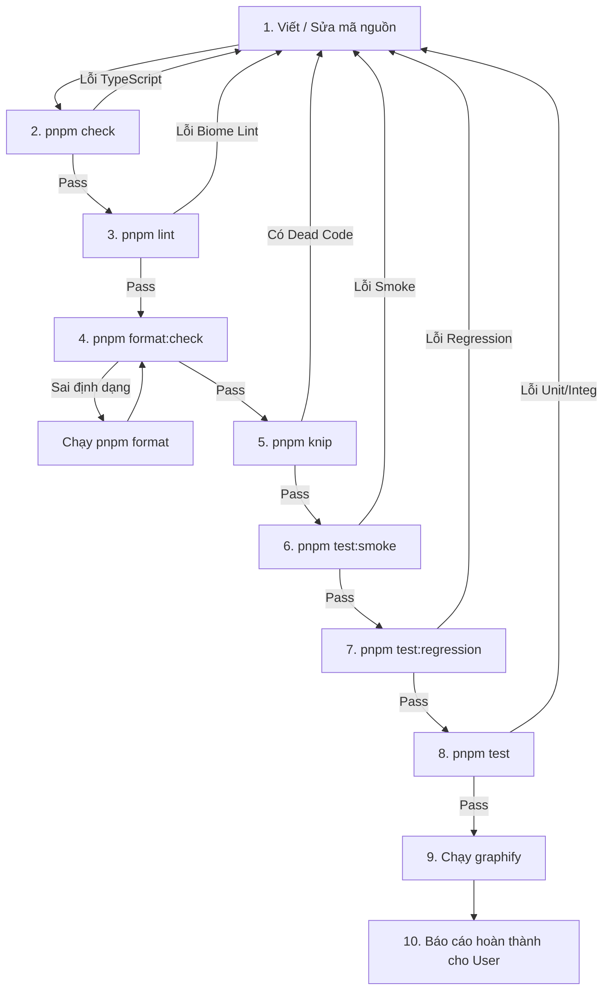

# 📋 QUY TRÌNH PHÁT TRIỂN & HỆ THỐNG KIỂM THỬ (DEVELOPMENT & TESTING WORKFLOW)

> **Tài liệu quy chuẩn bắt buộc** dành cho tất cả nhà phát triển (Developers) và AI Coding Agents khi tham gia chỉnh sửa, thêm tính năng hoặc tái cấu trúc mã nguồn dự án **Soát lỗi chính tả EPUB (epub-spell-check)**.

---

## 🔒 1. Quy tắc Quản lý Gói & Git Hooks (Package Manager & Git Hooks)

- **CHỈ ĐƯỢC DÙNG `pnpm`** (Tuyệt đối không dùng `npm` hoặc `yarn`).
- Luôn tuân thủ lockfile `pnpm-lock.yaml`.
- **Git Hooks tự động (`simple-git-hooks`)**:
  - Tự động chạy `pnpm dicts:pull-from-kv` trước mỗi commit để đồng bộ từ điển mới nhất từ Cloudflare KV về `public/` (chạy non-blocking).

```bash
# Cài đặt dependencies và kích hoạt Git Hooks
pnpm install

# Cài đặt package mới
pnpm add <package-name>

# Cài đặt dev dependency
pnpm add -D <package-name>
```

---

## 🧱 2. Kiến trúc Hệ Thống Kiểm Thử 3 Tầng (3-Tier Testing Strategy)

Hệ thống test được xây dựng với **Vitest** và **jsdom**, bao phủ 100% các luồng cốt lõi từ trích xuất văn bản EPUB, giải thuật phân tích chính tả tiếng Việt, kiểm toán chất lượng từ điển đến khôi phục đóng gói file EPUB sạch:

```
                          ALL TEST SUITES
                                │
        ┌───────────────────────┼───────────────────────┐
        │                       │                       │
     TẦNG 1                  TẦNG 2                  TẦNG 3
   SMOKE TESTS         UNIT / INTEGRATION          REGRESSION
   (test:smoke)           (test / unit)        (test:regression)
        │                       │                       │
     ~350ms                   ~1s                     ~400ms
        │                       │                       │
  Mỗi lần lưu code        Khi sửa module        Trước khi commit
```

---

### 🔹 Tầng 1: Smoke Tests (`pnpm test:smoke`)

- **Tốc độ**: Siêu nhanh (~300-400ms).
- **Mục tiêu**: Chạy liên tục mỗi khi lưu/thay đổi code để đảm bảo các luồng chức năng xương sống không bị gãy:
  1. Nạp và phân tích EPUB (`JSZip` parsing).
  2. Bóc tách cây DOM và trích xuất text nodes (`leaf-extractor`).
  3. Nhận diện lỗi từ vựng tiếng Việt, lỗi gõ máy, lỗi viết hoa (`analysis-core`).
  4. Đóng gói và ghi đè EPUB đã sửa chính tả (`epub-writer`).

### 🔹 Tầng 2: Unit & Integration Tests (`pnpm test:unit` hoặc `pnpm test`)

- **Tốc độ**: ~1 giây (15 test files / 118+ tests).
- **Mục tiêu**: Kiểm tra chuyên sâu từng thuật toán, hàm logic và thành phần giao diện:
  - `analysis-core.test.ts`: 4 tầng đối chiếu từ điển, quy tắc chính tả, lỗi dấu thanh cũ/mới, lỗi gõ máy.
  - `analyzer.test.ts`: Bộ phân tích tổng hợp, bóc tách token và đếm lỗi.
  - `filter.test.ts`: Bộ lọc tìm kiếm và bật/tắt đa chọn nhóm lỗi (`enabledErrorTypes`).
  - `dict-quality.test.ts`: Phân loại rác Tier A/Tier B, gom nhóm gần trùng lặp Levenshtein distance, chấm điểm rác và danh sách `ignoredPairs`.
  - `dict-validator.test.ts`: Cảnh báo thêm từ sai định dạng, OCR noise trên Admin Dashboard.
  - `epub-roundtrip.test.ts`: Đảm bảo bóc tách, sửa từ và đóng gói lại EPUB bảo toàn 100% cấu trúc HTML/CSS/OPF.
  - `merge-dicts.test.ts` & `merge-dicts-validation.test.ts`: Công cụ merge và chuẩn hóa từ điển.
  - `leaf-extractor.test.ts`, `path.test.ts`, `structured-clone.test.ts`, `user-workflow.test.ts`.

### 🔹 Tầng 3: Regression Safety Net (`pnpm test:regression`)

- **Tốc độ**: ~400ms.
- **Mục tiêu**: **Tấm lưới an toàn vĩnh viễn** chống lỗi phát sinh sau khi refactor:
  - **EPUB Round-Trip Preservation**: Đọc EPUB → sửa từ lỗi → xuất EPUB mới bảo toàn tính hợp lệ của ZIP, OPF spine, manifest và định dạng xhtml.
  - **Spelling Accuracy Matrix**: Đảm bảo không phát sinh false positive đối với tên riêng, từ viết tắt, từ mượn quốc tế và các biến thể dấu thanh tiếng Việt.
  - **Dictionary Precedence Enforcement**: Duy trì đúng trật tự ưu tiên `CUSTOM -> NAMES -> NON-VN -> VN -> SPELLING RULES -> UNKNOWN`.

---

## 🎯 3. Ma Trận Hướng Dẫn: "Sửa Gì - Chạy Test Gì?" (Test Decision Matrix)

| Bạn vừa sửa module nào?                                  | Các file liên quan                                                                           | Lệnh Test bắt buộc phải chạy                                                                              |
| :------------------------------------------------------- | :------------------------------------------------------------------------------------------- | :-------------------------------------------------------------------------------------------------------- |
| **Mọi thay đổi nhỏ / Lưu code**                          | Bất kỳ file nào trong `src/`                                                                 | `pnpm test:smoke`                                                                                         |
| **Lõi phân tích chính tả (Analysis Core & Rules)**       | `src/utils/analysis-core.ts`<br/>`src/utils/analyzer.ts`                                     | `pnpm test:smoke`<br/>`vitest tests/unit/analysis-core.test.ts tests/unit/analyzer.test.ts`<br/>`pnpm test:regression` |
| **Bộ lọc lỗi & State quản lý (Filter & AppState)**       | `src/state.svelte.ts`<br/>`src/utils/filter.ts`<br/>`src/components/ErrorList.svelte`        | `vitest tests/unit/filter.test.ts`<br/>`pnpm test`                                                        |
| **Kiểm toán chất lượng từ điển (Dict Quality & Audit)** | `src/utils/dict-quality.ts`<br/>`scripts/clean-dicts.ts`<br/>`src/components/admin/DictAuditPanel.svelte` | `vitest tests/unit/dict-quality.test.ts`<br/>`pnpm dicts:clean --dry-run`<br/>`pnpm test`               |
| **Bộ trích xuất & Đóng gói EPUB**                        | `src/utils/leaf-extractor.ts`<br/>`src/utils/epub-writer.ts`                                 | `vitest tests/unit/leaf-extractor.test.ts tests/unit/epub-writer.test.ts tests/unit/epub-roundtrip.test.ts`<br/>`pnpm test:regression` |
| **Admin Dashboard & Functions API**                      | `src/components/admin/**`<br/>`src/utils/dict-admin.ts`<br/>`functions/api/**`              | `pnpm check`<br/>`vitest tests/unit/dict-validator.test.ts`<br/>`pnpm test`                              |
| **Script gộp từ điển (Merge Dicts)**                     | `scripts/merge-dicts.ts`                                                                     | `vitest tests/unit/merge-dicts.test.ts tests/unit/merge-dicts-validation.test.ts`                         |
| **Tất cả Refactor diện rộng**                            | `src/**`                                                                                     | `pnpm check`<br/>`pnpm lint`<br/>`pnpm test`<br/>`pnpm test:regression`                                   |

---

## 🔄 4. Chu trình Chỉnh Sửa Code Chuẩn (Standard Quality Gate Flow)

Mỗi khi thực hiện bất kỳ thay đổi nào trong mã nguồn, bạn **PHẢI** thực hiện tuần tự theo quy trình sau:



---

### Chi tiết các bước Quality Gates:

1. **Bước 1: Viết / Sửa code**: Tuân thủ Svelte 5 Runes (`$state`, `$derived`, `$props`) và kiến trúc mô-đun hóa.
2. **Bước 2: Kiểm tra kiểu (`pnpm check`)**: Đảm bảo **0 errors, 0 warnings** với `svelte-check`.
3. **Bước 3: Kiểm tra linter (`pnpm lint`)**: Đảm bảo tuân thủ tiêu chuẩn Biome Linter (`biome check .`).
4. **Bước 4: Chuẩn hóa format (`pnpm format:check`)**: Đảm bảo tuân thủ `biome.json`. Nếu sai, chạy `pnpm format`.
5. **Bước 5: Quét mã rác (`pnpm knip`)**: Không để lọt exports thừa, file mồ côi hoặc dependencies không dùng.
6. **Bước 6: Chạy Smoke Tests (`pnpm test:smoke`)**: Xác nhận ngay các luồng chính hoạt động ổn định.
7. **Bước 7: Chạy Regression Suite (`pnpm test:regression`)**: Đảm bảo không làm hỏng tính năng xử lý EPUB và soát lỗi.
8. **Bước 8: Chạy Toàn bộ Unit Suite (`pnpm test`)**: Xác thực toàn bộ 15 test files và 118+ kịch bản kiểm thử.
9. **Bước 9: Cập nhật Graphify (`graphify . --code-only && graphify cluster-only .`)**: Đồng bộ đồ thị tri thức kiến trúc dự án.
10. **Bước 10: Báo cáo kết quả cho Người Dùng**: Tóm tắt file sửa và báo cáo trạng thái PASS của toàn bộ Quality Gates.

---

## ⚡ 5. Bảng Tra Cứu Lệnh Nhanh (Cheat Sheet)

| Lệnh                     | Ý nghĩa                                                  | Thời gian  | Khi nào dùng                |
| :----------------------- | :------------------------------------------------------- | :--------- | :-------------------------- |
| `pnpm dev`               | Khởi chạy máy chủ phát triển Vite (localhost:5173)       | —          | Khi lập trình giao diện     |
| `pnpm check`             | Kiểm tra lỗi TypeScript & Svelte Runes                   | ~1.5s      | Sau khi sửa code            |
| `pnpm lint`              | Kiểm tra lỗi Biome linter                                | ~200ms     | Trước khi commit            |
| `pnpm format`            | Tự động format toàn bộ codebase bằng Biome               | ~200ms     | Khi cần sửa định dạng code  |
| `pnpm format:check`      | Kiểm tra tính tuân thủ định dạng Biome                   | ~200ms     | Trong CI / Quality Gate     |
| `pnpm knip`              | Quét file / export / dependency rác                     | ~1.5s      | Trước khi commit            |
| `pnpm test:smoke`        | Chạy bộ kiểm thử nhanh các luồng xương sống              | **~350ms** | **Mỗi khi lưu code**        |
| `pnpm test:unit`         | Chạy các bài unit test trong `tests/unit/`               | ~1s        | Khi phát triển module       |
| `pnpm test:regression`   | Chạy kiểm thử an toàn chống regression                   | **~400ms** | **Trước khi commit**        |
| `pnpm test`              | Chạy toàn bộ 15 test suites (118+ bài test)              | ~1s        | Thường xuyên trong khi code |
| `pnpm test:watch`        | Chế độ tự động test lại khi lưu file                     | —          | Khi viết tính năng mới      |
| `pnpm dicts:clean`       | Kiểm toán và dọn dẹp từ điển rác CLI (Tier A/B/fuzzy)    | ~500ms     | Khi bảo trì từ điển         |
| `pnpm dicts:pull-from-kv`| Kéo dữ liệu từ điển mới nhất từ Cloudflare KV về local   | ~1s        | Pre-commit hoặc thủ công    |
| `pnpm build`             | Đóng gói bản phát hành Production                        | ~2s        | Trước khi deploy            |

